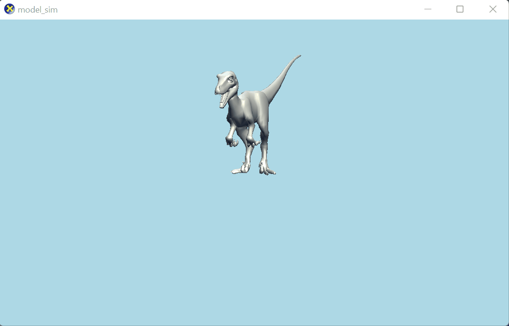

### DirectX 11 3D Simulation Template

3D simulation template utilizing [DirectXTK](https://github.com/microsoft/DirectXTK). I put this together as a starting point for a few of my 3D simulation projects that utilize Microsoft's DirectX Toolkit Library. Some cool projects I've put together utilizing this template and the toolkit library: 

Planet Simulation: 

Raptor Simulation: 

Car Simulation: 

This template doesn't include any models, it's meant to serve as a guide for building and simulating your own models. I'll have future posts about creating and importing your own models but for now, you can drop your sdkmesh and any supporting files (like material files or texture files) into the `d3d-template/` folder. By default it creates a model from `model.sdkmesh` but you can customize and change the name and even the method used to create the model - inside `Game::CreateDeviceDependentResources`. You can update the mesh name and method for creating the model (for example if you want to use CMO use `Model::CreateFromCMO`). Likewise, if you want to change the directory of the model, you can do so by updating the `IEffectFactory` - see [here](https://github.com/Microsoft/DirectXTK/wiki/EffectFactory#directories) for more info. All of this is built on top of DirectXTK and their wiki has all the documentation you need to create and fine tune your simulation, I highly recommend reading through it and seeing all the amazing things you can do - [Wiki](https://github.com/Microsoft/DirectXTK/wiki). For example, you can visit [this page](https://github.com/microsoft/DirectXTK/wiki/Effects) for information about adding effects. In the second example above, the raptor model has a lighting effect applied to it that gives it a different look.

Credit:
High quality models to experiment with: https://free3d.com/3d-models/